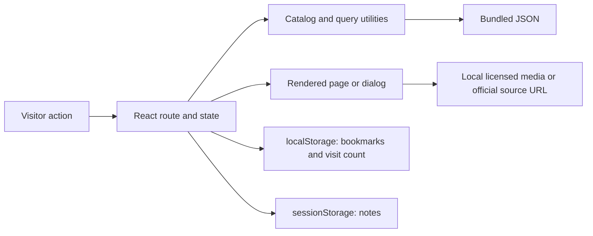
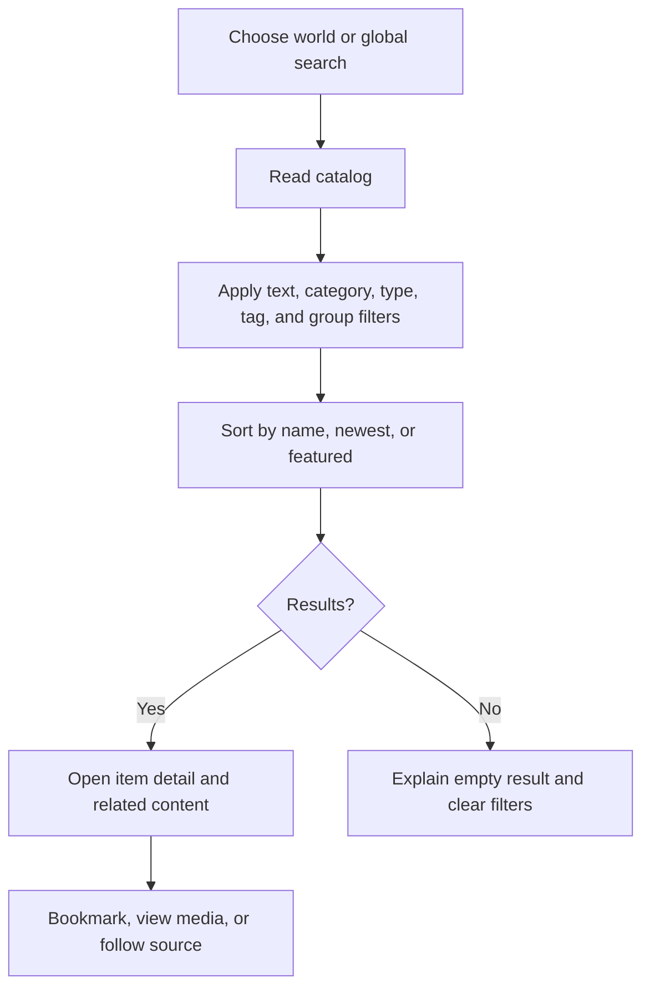
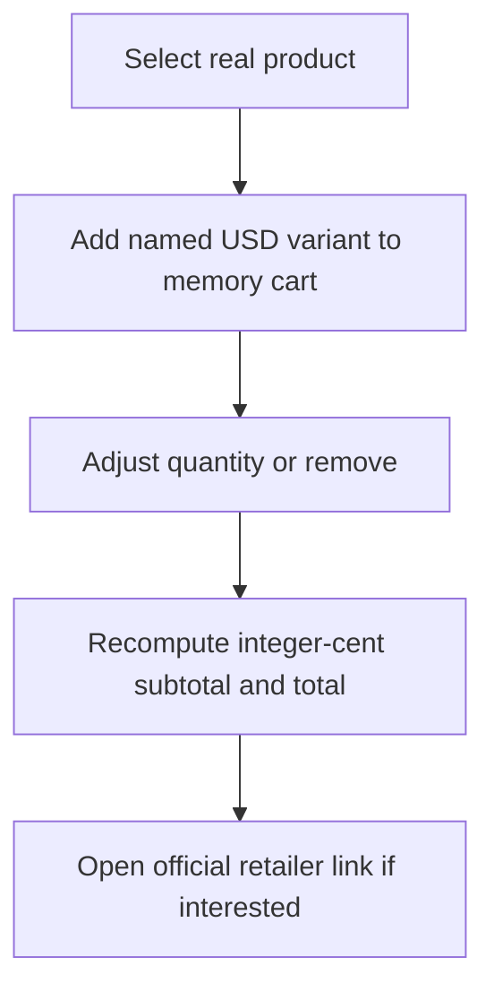

# FandomVerse project report

## Problem definition

Fans often need to visit separate sites for character information, events, trailers, articles, and merchandise. FandomVerse brings seven fandom categories into one accessible discovery interface. The project prioritizes factual attribution, media reuse permission, clear historical versus upcoming dates, and working local demonstrations of the SRS interactions. It does not claim affiliation with any franchise or retailer.

## Design specification

The visual idea is a cinematic portal into seven worlds. Deep charcoal provides a quiet reading surface; restrained violet and cyan draw attention to actions, while each category has its own color. The home hero says “Seven Worlds. One FandomVerse.” A large editorial feature, varied category portal composition, source-aware cards, and calmer long-form pages prevent the interface from becoming a uniform grid. Responsive rules cover desktop, tablet, and mobile. Keyboard focus, semantic controls, reduced motion, a decorative-motion pause switch, alt text, and modal focus behavior support accessibility.

Functional areas are home, world hubs, global search, profiles, articles, galleries/media, events, release calendar, trailers, merchandise/cart, bookmarks/notes, scripted chatbot, About, Contact, and demo login/signup. Every persistent navigation area offers routes to key pages. Each catalog record has a stable ID and source links. Cards without permitted imagery explain the omission and link to the source rather than displaying an invented substitute.

## Architecture and data flow

The implementation uses React, Vite, JavaScript, CSS, and static JSON. There is no backend. Hash routing supports direct loading and back/forward in a static preview. React state holds the transient cart and open dialogs. `localStorage` holds bookmarks and the simulated visitor count; `sessionStorage` holds private notes. Official links and licensed local media are separate from application data.

## Content and media method

The current catalogs have at least five authentic profiles and three sourced events in each category. K-Pop “characters” are interpreted as factual artist/member profiles; the five initial records are BTS members. Articles and biographies are original summaries grounded in linked publisher, franchise, event, artist, and retailer pages. Past items are labelled past; future calendar entries use official announcements and dates. Prices are a dated USD snapshot, not a live shop feed. The Commons file pages and license terms for 56 downloaded photographs and simple logos, including Anime, Gaming, Comics, Manga, Star Wars, and TV subject photos, and the publisher’s Creative Commons game trailer are in `MEDIA-CREDITS.md`. Cosplay is identified as fan performance, and performer photos are not presented as character stills. The trailer was genuinely transcoded to WebM/MP4, with a still poster and an audio excerpt. Official video previews from multiple Anime franchises and other worlds use YouTube oEmbed metadata for remote thumbnails and on-demand players. They require internet and are not downloaded or relicensed. Other official media without established download permission is linked. Missing product-photo rights are disclosed in the interface.

## Test data and results

Test inputs included all seven world IDs; a cross-type query for “Tanjiro” combined with Anime/Profile filters; a no-result query; quantity changes on a $5.99 product; bookmark add/removal and export; a private note across a reload and a new browser session; a known chatbot question and unknown question; unavailable media; and denied, unavailable, and successful geolocation. Browser tests also checked direct routes, history, gallery keyboard controls, demo auth, reduced-motion, and layout at phone, tablet, and desktop widths. Results and exact Lighthouse scores are in `TEST-RESULTS.md`; reports and screenshots are in `docs/audits/` and `docs/screenshots/`.

## Installation and demonstration

Node.js 20.19+ or 22.12+ and npm are required. Run `npm install`, then `npm run dev` and open Vite's local URL. For the production version run `npm run build`, `npm run preview`, and open the preview URL. Start preview before `npm run test:browser` or `npm run audit`. `npm test` checks data and pure logic. In Windows PowerShell with restricted script execution, invoke `npm.cmd` instead of `npm`. Internet is needed for official external links, authorized embeds, fonts only if remote (the current fonts are bundled), and the Google map when configured. Local licensed assets work offline.

## Assumptions, limits, and responsibility

The site is an independent educational prototype deployed at https://fandomverse-iota.vercel.app. Cart, login/signup, and visitor count are explicitly demonstrations. Team identity and DHA Karachi map location were supplied by the participant and are configured. Franchise art and product photography are not redistributed without permission. Cards use subject-specific visuals where permitted and a designed rights fallback otherwise; unrelated event photos are not reused as subject images. Audio is provided where a reusable publisher trailer allowed an excerpt; other categories link to official media. A live smoke test does not prove 24/7 hosted availability or production concurrency. The participant should review, personalize, and be able to explain the work before submission.

## AI acknowledgement

OpenAI Codex assisted with research organization, interface design, implementation, tests, documentation, and mentoring. The participant remains responsible for reviewing facts, licenses, code, and final submission. No live AI model is called by FandomVerse itself.
